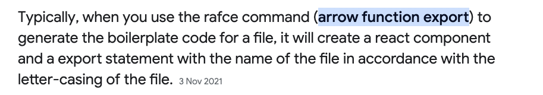

- In this application we will be using the `create-react-app` command to generate the project. `[[ Project Scaffold ]]`. Using the scaffold => a basic structure of react application is created.
- To run the project command used => `npm run start` or `npm start`

- To create a react component: `rafce` : this stands for `react arrow function component export`

  
