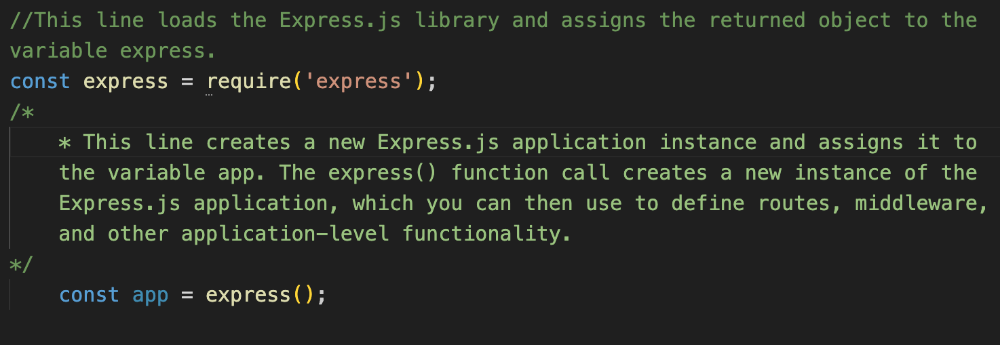

# Backend Development

- install the package.json file: `npm init -y`
- install the express dependencies: `npm i express`
- create a *server.js* file.

# Instance of the express: 
-  require() function is a built-in Node.js function that allows you to load and use external modules (libraries) in your application. By calling require('express'), you are telling Node.js to load the Express.js library and make it available in your code.

