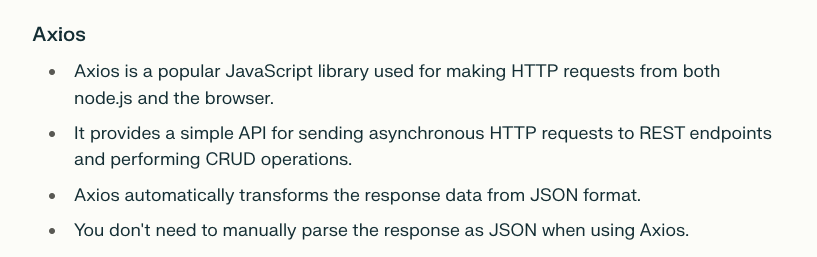
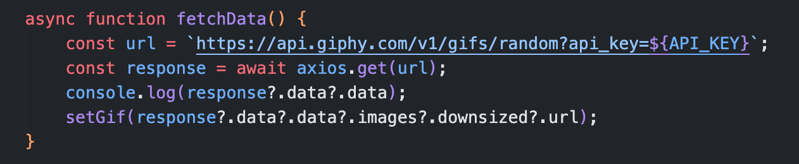
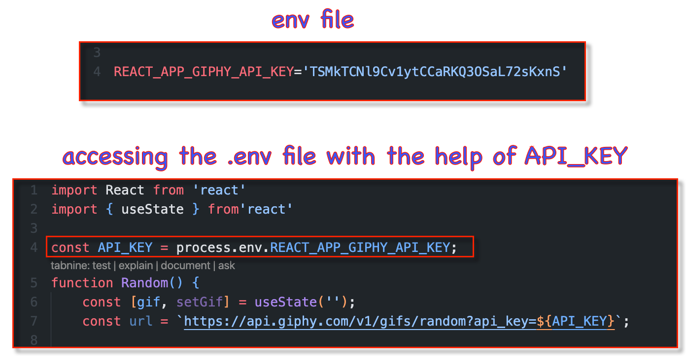

1. In this project we have used axios => to need to run the following command `npm install axios`.

- Axios is a Javascript library used to make HTTP requests from node.js. In the fetch() method, we need to parse the output into the Json format. but this step is not required in axios.

  

- To make axios call => we need to use `axios.get(URL)`

  

2. Install the `tailwind plugin`

3. In the Random component => we have shown the random gif -> which is fetched from the API. Hence we need to make a state variable whose value keep on changing as the user clicks the button. This state variable represents the gif

4. In the code we `.env file` in which we have provided the URL to fetch the gif

- A .env file is a text file that stores sensitive information for projects, such as API keys, database credentials, and configuration settings.
- To access the `.env` data, we have a method => `process.env`

